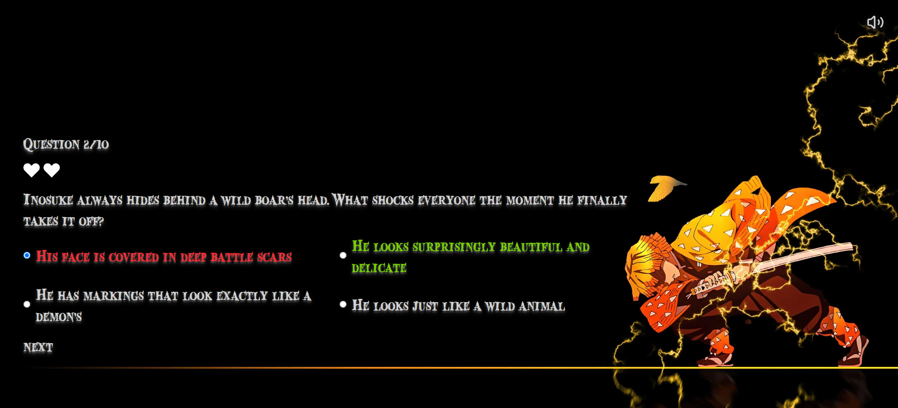

# ⚔️ Demon Slayer Anime Quiz Game

A polished, fully interactive React-based trivia game dedicated to the _Demon Slayer: Kimetsu no Yaiba_ anime universe. Test your knowledge, survive with a limited number of lives, and enjoy a dynamic anime-themed UI with sound effects and custom animations.

## 🔗 Links

- **Live Site:** [View Live Demo](https://demon-slayer-quiz-game.vercel.app/)
- **GitHub Repository:** [View Source Code](https://github.com/iviktorry/demon-slayer-quiz-game)

---

## 🛠 My Process

## 🛠 Tech Stack

- **React** — Component-based architecture and state management
- **Tailwind CSS** — Utility-first styling with custom shadows and media queries
- **Lucide React** — Clean, scalable UI icons
- **Vite** — Fast modern frontend build tool

## ✨ Features

- **Dynamic Sound & Music Engine:** Features ambient background tracks and custom SFX for correct/incorrect answers and game over states, with global Mute/Unmute toggle support.
- **Interactive Game Logic:** Live track of lives, score counting, and post-submission state lock (disabling option changes once submitted).
- **Responsive & Accessible Design:** Semantic HTML structure and full accessibility (A11y) support, with adaptive background images changing dynamically based on screen viewport width.
- **Smooth Animations:** Fading state transitions and custom Tailwind drop-shadow effects tuned for an immersive anime aesthetic.

## 🧠 What I Learned & Practiced

Building this quiz was a great hands-on practice in combining interactive UI with complex client-side state and audio management:

- **Dynamic Component Rendering:** Mastered screen and state switching using `switch` logic and mapping state keys directly to component instances.
- **Smart vs. Dumb Component Pattern:** Separated presentation-only components (Dumb/UI) from stateful logical components (Smart), keeping naming conventions clean and clean code practices intact.
- **Asset Optimization:** Practiced manual image compression to modern `.webp` formats, drastically reducing bundle size and initial load times.
- **Tailwind CSS Mastery:** Deep-dived into Tailwind's official documentation to leverage advanced utility-first styling, text/drop shadows, and responsive background handling without custom CSS hacks.
- **Audio Lifecycle Management:** Implemented sound effects and non-resetting looping background tracks while avoiding memory leaks and state reset bugs.

---

## 🙋‍♀️ Author

- GitHub — [@iviktorry](https://github.com/iviktorry)
- Frontend Mentor — [@iviktorry](https://www.frontendmentor.io/profile/iviktorry)
